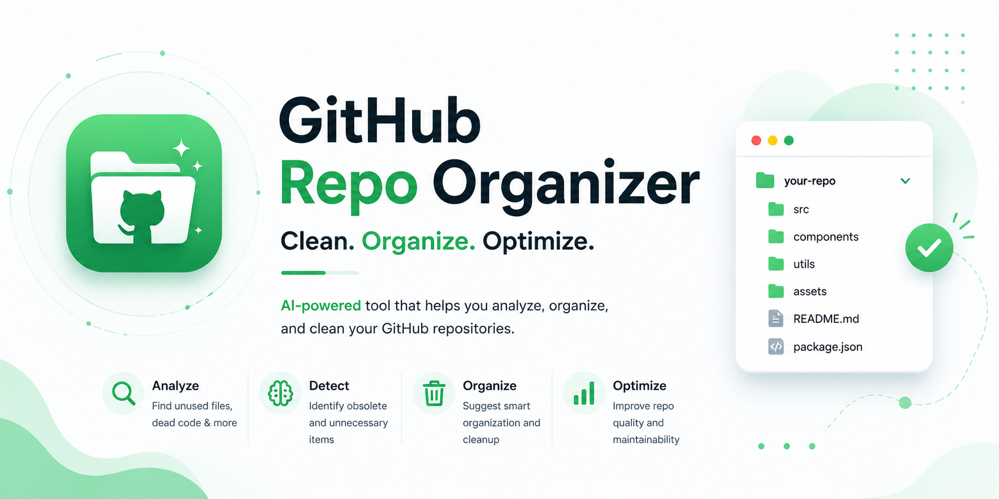

<p align="center">
  
</p>

<h1 align="center">GitHub Repo Organizer</h1>
<p align="center">AI-powered desktop tool to analyze, organize, and clean your GitHub repositories.</p>

<p align="center">
  <a href="https://github-repo-cleaner-aiwebpage.vercel.app">Website</a> ·
  <a href="https://github.com/palamut62/github-repo-cleaner-ai/releases/latest">Releases</a> ·
  <a href="https://github.com/palamut62/github-repo-cleaner-ai/issues">Issues</a> ·
  <a href="#getting-started">Getting Started</a>
</p>

<p align="center">
  
  
  
  
  
</p>

---

## Table of Contents

- [Overview](#overview)
- [Features](#features)
- [Tech Stack](#tech-stack)
- [Project Structure](#project-structure)
- [Getting Started](#getting-started)
- [Configuration](#configuration)
- [Usage](#usage)
- [Building & Releases](#building--releases)
- [Warnings](#warnings)
- [Keyboard Shortcuts](#keyboard-shortcuts)
- [Roadmap](#roadmap)
- [Contributing](#contributing)
- [Security](#security)
- [FAQ](#faq)
- [License](#license)

## Overview

**GitHub Repo Organizer** is an Electron desktop application that helps developers take full control of their GitHub account. List and filter every repository, publish local folders with smart `.gitignore` generation, analyze stale or oversized repos, sync forks, and use AI to rename repositories, write descriptions, generate READMEs, and improve commit messages.

> Target users: developers and maintainers who manage many repositories and want a fast, visual way to clean and organize them.

## Features

### Core
- **Repository Listing** — view all repositories with Source/Fork distinction
- **Filtering & Sorting** — filter by Source/Fork, sort by update date
- **Search** — quickly find repositories by name
- **Dual View Modes** — switch between List and Grid
- **License Status** — see MIT / other / no-license at a glance
- **Bulk Selection & Deletion** — select and delete multiple repos at once

### Add Project & Publish
Publish local folders to GitHub directly from the app:
- **Folder Selection** — pick one or multiple local folders
- **Auto Git Init** — initializes a repo if none exists
- **Visibility Control** — set each repo Public or Private individually
- **Live Progress** — per-repo status during create & push

**Auto `.gitignore` Generation** — detects the project type (Node, React/Next, Vue/Nuxt, Angular, Svelte, Electron, Python, Java, Go, Rust, Ruby, PHP, C/C++, Swift, Unity, and a generic fallback) and generates an appropriate `.gitignore` before the first commit. Skipped if one already exists.

**Commit Message Templates** — choose Simple, Conventional Commits, Scoped, or Custom (`{{project_name}}` placeholder), with live preview and per-row override.

### AI-Powered (requires OpenRouter API key)
- **Smart Rename** — suggests repo names from README content
- **Description Generator** — writes professional descriptions
- **README Creator** — generates full README.md by analyzing repo structure
- **Commit Fixer** — improves commit messages (Conventional Commits); supports single Apply and Bulk Apply *(performs a force push)*

### Organization Tools
- **Visibility Control** — toggle Public/Private
- **Topics Manager** — add or remove topics
- **License Manager** — add MIT, Apache 2.0, GPL-3.0, or ISC
- **Setup/Clone Info** — one-click copy of HTTPS & SSH clone URLs

### Repository Analysis
- **Stale Repos** — not updated in 6+ months
- **Large Repos** — over 50MB
- **Unchanged Forks** — forks without modifications
- **No-Stars Repos** — repositories without stars
- **Clone Counts** — 14-day clone counts on owned repos

### Fork Management
- **Sync Status** — see if a fork is behind upstream
- **One-Click Sync** — pull latest changes from the parent repo
- **Parent Info** — quick access to parent repository details

### Repository Details
Double-click any repository for stats (stars, forks, watchers, issues), language breakdown, recent commits, clone URLs, and quick setup commands.

## Tech Stack

| Layer | Technology |
|---|---|
| Desktop runtime | Electron 28 |
| Language / runtime | Node.js 20 |
| Packaging | electron-builder |
| Icons | sharp, png-to-ico |
| APIs | GitHub REST API, OpenRouter API (Moonshot AI / Kimi) |

## Project Structure

```
github-repo-cleaner-ai/
├── main.js              # Electron main process
├── preload.js           # Secure IPC bridge
├── index.html           # Renderer UI
├── generate-icons.js    # Builds icon.png + multi-size icon.ico
├── generate-sidebar.js  # Sidebar generation helper
├── assets/              # Icons and banner
│   ├── banner.png
│   ├── icon.png
│   └── icon.ico
└── package.json
```

## Getting Started

### Prerequisites
- [Node.js](https://nodejs.org/) 20 or later
- A GitHub Personal Access Token with `repo` and `delete_repo` scopes
- *(Optional)* An [OpenRouter](https://openrouter.ai/) API key for AI features

### Installation

```bash
git clone https://github.com/palamut62/github-repo-cleaner-ai.git
cd github-repo-cleaner-ai
npm install
```

### Run

```bash
npm start
```

Prefer a packaged build? Download the latest installer from the [Releases page](https://github.com/palamut62/github-repo-cleaner-ai/releases/latest).

## Configuration

Open **Settings** in the sidebar and configure:

| Setting | Description |
|---|---|
| GitHub Token | Personal access token for GitHub API access |
| OpenRouter Key | API key for AI-powered features |
| Default Visibility | `public` or `private` for new repos |
| Default Branch | `main` or `master` |
| Auto `.gitignore` | Pre-check the `.gitignore` box for new folders |
| Commit Template | Default commit message style for new repos |

### Getting a GitHub Token
1. Go to **GitHub → Settings → Developer settings → Personal access tokens**
2. Generate a token with `repo` and `delete_repo` scopes
3. Paste it into the app's Settings

### Getting an OpenRouter API Key
1. Visit [OpenRouter](https://openrouter.ai/)
2. Create an account and generate an API key
3. Paste it into the app's Settings

## Usage

### Publishing a Local Project
1. Open **Add Project** in the sidebar
2. Click **Select Folder** (or **Select Multiple** for batch)
3. The app auto-detects the project type and pre-fills the `.gitignore` checkbox
4. Choose a commit message template from the toolbar
5. Adjust repo names, visibility, descriptions, and commit messages
6. Click **Create & Push**

### Cleaning & Organizing
- Use the **Analysis** views to surface stale, large, unchanged-fork, and no-stars repositories
- Apply **Topics**, **License**, and **Visibility** changes individually or in bulk
- Run **AI** actions to rename, describe, document, or fix commit messages

## Building & Releases

```bash
# Generate app icons from assets/icon-original.png
npm run icons

# Build the Windows installer (NSIS)
npm run build

# Portable Windows build
npm run build:portable

# Linux builds (AppImage + deb)
npm run build:linux
```

Artifacts are written to the `dist/` folder. Tagged releases are published via the GitHub Actions **Build Windows Installer** workflow and attached to the corresponding GitHub Release.

## Warnings

- **Deleting Repositories** is permanent — deleted repos **cannot** be restored.
- **Renaming Repositories** changes the remote URL. Update locals with `git remote set-url origin NEW_URL`.
- **Visibility Changes** to private may require a paid GitHub plan.
- **AI Commit Fixer** rewrites git history and force-pushes. Use only where this is acceptable.

## Keyboard Shortcuts

| Shortcut | Action |
|---|---|
| `Ctrl/Cmd + F` | Focus search |
| `Esc` | Close modals |

## Roadmap

- [ ] macOS packaged build
- [ ] Additional AI model providers
- [ ] Saved filters and views
- [ ] Repository tagging/grouping

## Contributing

Contributions are welcome. Fork the repo, create a feature branch, commit with clear messages, and open a pull request. For larger changes, please open an issue first to discuss the direction.

## Security

Tokens and API keys are stored in your local app configuration and are never committed to the repository. If you discover a security issue, please open a private report via GitHub Issues rather than disclosing it publicly.

## FAQ

**Do I need an OpenRouter key?** No — only the AI features require it. Everything else works with just a GitHub token.

**Which platforms are supported?** Windows (NSIS installer + portable) and Linux (AppImage/deb). The source runs anywhere Electron does.

**Is repository deletion reversible?** No. Deletions are permanent on GitHub.

## License

Released under the [MIT License](LICENSE).

---

<p align="center">Made by <a href="https://github.com/palamut62">palamut62</a></p>
